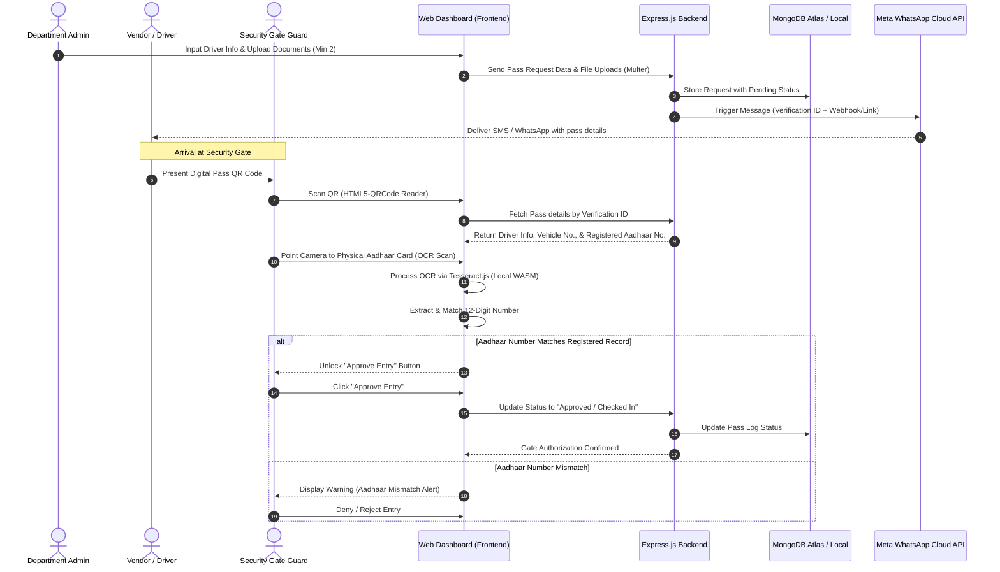

# 🚗 Digital Vehicle Entry System (DVES)

[](https://react.dev/)
[](https://nodejs.org/)
[](https://www.mongodb.com/)
[](https://tailwindcss.com/)
[](https://developers.facebook.com/docs/whatsapp/cloud-api)

A secure, paperless, and automated Digital Vehicle Entry System (DVES) that streamlines the authorization, verification, and monitoring of external vehicles and vendors entering secure premises. The system replaces manual entry processes with a centralized, real-time responsive dashboard that seamlessly connects departments, host employees, and security personnel.

---

## 📖 Table of Contents
1. [🌟 Key Features](#-key-features)
2. [📐 System Architecture & Data Flow](#-system-architecture--data-flow)
3. [🛠️ Tech Stack](#️-tech-stack)
4. [📁 Repository Structure](#-repository-structure)
5. [⚙️ Getting Started & Installation](#️-getting-started--installation)
6. [🔐 Environment Variables](#-environment-variables)
7. [🚦 Interactive Workflows](#-interactive-workflows)
8. [👤 Demo Accounts & Credentials](#-demo-accounts--credentials)

---

## 🌟 Key Features

*   🏢 **Departmental Pass Requests**: Intuitive frontend panels for departments (e.g., Milan, Akash, CPED, Corporate) to submit vehicle entry requests, select host employees, and upload supporting documents.
*   📷 **Aadhaar OCR Verification**: Integrates **Tesseract.js** directly inside the browser for real-time document OCR scanning. Automatically extracts and validates the 12-digit Aadhaar number against the department-entered request record.
*   🔍 **Gate Pass QR Scanning**: Security guards scan the driver's mobile-delivered QR code using **HTML5-QRCode** to instantly pull up request records, photos, and files.
*   💬 **WhatsApp Cloud API Integration**: Automated messaging dispatch that sends a unique verification ID (e.g., `BDLXXXXXXX`) and status updates directly to the vendor's or driver's mobile number.
*   🔒 **Multi-Document Verification**: Compulsory verification checks for Aadhar Cards, RC Books, Driving Licenses, and Pollution Certificates (minimum 2 documents required for request submission).
*   📋 **Role-Based Access Control (RBAC)**: Distinct layouts, views, and routing for **Security Personnel** (Entry clearance, QR code reader, Aadhaar OCR matching) and **Departments** (Request creation, history log tracking).

---

## 📐 System Architecture & Data Flow

Below is the application data-flow showing how a pass request travels from creation to gate clearance:



---

## 🛠️ Tech Stack

### Frontend & Scanning Engine
- **React (Vite):** Declarative, lightning-fast component rendering.
- **Tailwind CSS:** Modern, responsive UI design system with micro-interactions.
- **Tesseract.js:** Pure Javascript OCR for client-side text extraction.
- **HTML5-QRCode:** High-performance QR/Barcode scanning framework.
- **Axios:** Asynchronous HTTP communications.

### Backend & Core Services
- **Node.js & Express.js:** Fast, asynchronous REST API controller layer.
- **Mongoose & MongoDB:** Flexible NoSQL data store representing Passes, Users, and Employees.
- **Multer:** Secure, optimized file storage middleware for uploaded driver documents.
- **Meta WhatsApp Cloud API:** Integration engine for automated transactional templates.

---

## 📁 Repository Structure

```text
Digital-Vehicle-Entry-System/
├── backend/
│   ├── controllers/             # Express route controller handlers (e.g., verificationController)
│   ├── middleware/              # Authentication & RBAC middleware
│   ├── models/                  # Mongoose Schemas (User, Pass, Employee)
│   ├── routes/                  # REST Endpoint routes
│   ├── utils/                   # Shared utility modules (WhatsApp dispatcher, helper functions)
│   ├── uploads/                 # Local directory for uploaded driver documents (Aadhar, RC, etc.)
│   ├── Employee_Dataset.csv     # Employee repository for hosting lookup
│   ├── seedEmployees.js         # Script to seed employee datasets into MongoDB
│   ├── seedUsers.js             # Script to seed departments and security accounts
│   └── server.js                # Application entry point
│
└── frontend/
    ├── public/                  # Static assets & public assets
    ├── src/
    │   ├── assets/              # Shared image/icon assets
    │   ├── pages/               # Views (Department Dashboard, Security Terminal, Login)
    │   ├── App.jsx              # Main routing & application state wrapper
    │   └── main.jsx             # React DOM entry point
    ├── tailwind.config.js       # Tailwind configuration file
    └── vite.config.js           # Vite development server configuration
```

---

## ⚙️ Getting Started & Installation

### 📋 Prerequisites
Ensure you have the following installed on your machine:
*   [Node.js](https://nodejs.org/) (v16.0.0 or higher)
*   [MongoDB](https://www.mongodb.com/) (running locally, e.g., `mongodb://127.0.0.1:27017` or Atlas cloud connection string)

### 🚀 Setup Steps

#### Step 1: Clone the Repository
```bash
git clone https://github.com/Lokeshwar-09/Digital-Vehicle-Entry-System.git
cd Digital-Vehicle-Entry-System
```

#### Step 2: Configure and Run Backend
1. Navigate to the backend directory:
   ```bash
   cd backend
   ```
2. Install all required dependencies:
   ```bash
   npm install
   ```
3. Set up your environment configuration by copying or creating a `.env` file (see details below).
4. Run the database seeding scripts:
   ```bash
   node seedUsers.js
   ```
   ```bash
   node seedEmployees.js
   ```
5. Start the backend server:
   ```bash
   npm start
   ```
   *The backend server runs on `http://localhost:5000` by default.*

#### Step 3: Configure and Run Frontend
1. Open a new terminal window and navigate to the frontend directory:
   ```bash
   cd frontend
   ```
2. Install all required UI dependencies:
   ```bash
   npm install
   ```
3. Boot up the local development server:
   ```bash
   npm run dev
   ```
4. Access the web app in your browser at `http://localhost:5173`.

---

## 🔐 Environment Variables

Create a file named `.env` in the `backend/` folder and populate it with the following configuration keys:

| Environment Variable | Description | Example / Default Value |
| :--- | :--- | :--- |
| `PORT` | Local network port for the backend server | `5000` |
| `MONGO_URI` | MongoDB Connection URI string | `mongodb://127.0.0.1:27017/securityDB` |
| `JWT_SECRET` | Secret token used to sign JSON Web Tokens | `SuperSecretJWTKey123!` |
| `WHATSAPP_PHONE_ID` | Meta Developer Platform Phone Number ID | `102938475610293` |
| `WHATSAPP_TOKEN` | Meta Developer Permanent User Access Token | `EAAG...` |
| `SERVER_BASE_URL` | Base endpoint URL of the API server (for resolving documents) | `http://localhost:5000` |

---

## 🚦 Interactive Workflows

### 1️⃣ Creation (Department Dashboard)
1. Log in with a department account (e.g. user `corporate`, password `corporate123`).
2. Search and select the host employee in the lookup field.
3. Fill out driver details: Name, Phone Number, Vehicle Number, Aadhaar Number, and upload document PDFs/Images.
4. On click of **Generate Pass**, the database registers the pass, and the system triggers the Meta WhatsApp API to dispatch the pass code directly to the driver's phone.

### 2️⃣ Arrival (Security Checkpoint)
1. Log in with security credentials (user `security`, password `security123`).
2. Point the device camera at the QR code displayed on the driver's phone.
3. The dashboard queries the API database and displays the pass parameters, photos, and document uploads.

### 3️⃣ OCR Gate Verification
1. Position the driver's physical Aadhaar card within the camera OCR guide window.
2. Tesseract extracts the text layout and isolates the 12-digit Aadhaar pattern.
3. If it matches, the status updates to **Verified**, and the gate entry permission is granted.

---

## 👤 Demo Accounts & Credentials

To easily test the workflow, run `node seedUsers.js` in the `backend/` folder and use the following login parameters:

### Security Gate Officer
*   **Username:** `security`
*   **Password:** `security123`
*   **Role:** Security Guard / Gatekeeper

### Authorized Departments
For departmental pass requests, you can log in using any of the following department accounts (Password is `<username>123`):

<details>
<summary>🔑 Click to view all Department logins</summary>

| Department | Username | Password |
| :--- | :--- | :--- |
| **Corporate** | `corporate` | `corporate123` |
| **Milan** | `milan` | `milan123` |
| **Services & Others** | `services` | `services123` |
| **D&E** | `de` | `de123` |
| **Electronics** | `electronics` | `electronics123` |
| **Prithvi** | `prithvi` | `prithvi123` |
| **CDO** | `cdo` | `cdo123` |
| **Akash** | `akash` | `akash123` |
| **CPED** | `cped` | `cped123` |
| **CP-IGMP** | `cpigmp` | `cpigmp123` |
| **SFD** | `sfd` | `sfd123` |
| **Nag** | `nag` | `nag123` |
| **GSD** | `gsd` | `gsd123` |
| **Refurbishment** | `refurbishment` | `refurbishment123` |
| **LR-SAM** | `lrsam` | `lrsam123` |
| **B-05** | `b05` | `b05123` |
| **Vizag Unit** | `vizag` | `vizag123` |
| **Konkurs-M** | `konkurs` | `konkurs123` |
| **Components Production** | `components` | `components123` |
| **Services - BG** | `bg` | `bg123` |
| **Invar** | `invar` | `invar123` |
| **Launcher** | `launcher` | `launcher123` |
| **Astra** | `astra` | `astra123` |

</details>

---


